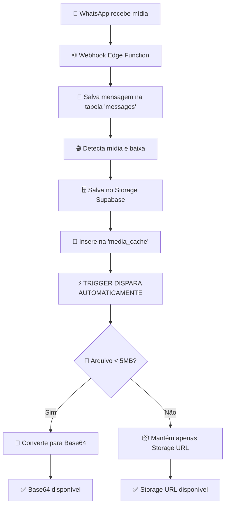

# 🧠 Sistema Inteligente de Conversão de Mídia

## 📋 Visão Geral

O sistema implementa uma estratégia híbrida para processamento de mídia WhatsApp:
- **Arquivos pequenos (< 5MB):** Convertidos automaticamente para Base64
- **Arquivos grandes (≥ 5MB):** Mantidos apenas como URL do Storage

## ⚡ Como Funciona

### 1. Fluxo Principal


### 2. Trigger Inteligente
**Localização:** `smart_media_conversion_trigger` na tabela `media_cache`
**Execução:** `BEFORE INSERT` - executa automaticamente

```sql
-- Lógica do trigger:
IF arquivo < 5MB THEN
  Converter para Base64
ELSE
  Manter apenas Storage URL
END IF
```

## 📊 Estratégia por Tipo de Arquivo

| Tipo | Tamanho Médio | Estratégia | Base64 | Storage |
|------|---------------|------------|---------|---------|
| **Audio** | 0.04MB | ✅ Base64 | Sim | Backup |
| **Image** | 0.11MB | ✅ Base64 | Sim | Backup |
| **Document** | 0.61MB | ✅ Base64 | Sim | Backup |
| **Video** | 10.71MB | 🗄️ Storage apenas | Não | Sim |

## 🎯 Acesso aos Dados

### Frontend (usa message_id)
```typescript
const getMediaUrl = (message) => {
  if (message.media_cache?.base64_data) {
    // Arquivo pequeno: Base64 imediato
    return `data:${message.media_type};base64,${message.media_cache.base64_data}`;
  } else if (message.media_cache?.original_url) {
    // Arquivo grande: Storage URL
    return message.media_cache.original_url;
  } else {
    // Fallback
    return message.media_url;
  }
};
```

### Agente IA (usa external_message_id)
```sql
-- Busca por external_message_id
SELECT 
  mc.base64_data,
  mc.original_url,
  mc.media_type,
  mc.file_size
FROM media_cache mc
WHERE mc.external_message_id = '3FC41ADF66E201B2B3C3';
```

## 🔧 Configurações

### Limites Atuais
- **Max Base64:** 5MB (5.242.880 bytes)
- **Timeout Download:** 15 segundos
- **Storage Bucket:** `whatsapp-media`

### Extensões Utilizadas
- **pg_net:** Download HTTP principal
- **http:** Fallback alternativo
- **encode/decode:** Conversão Base64

## 📈 Monitoramento

### View de Estatísticas
```sql
SELECT * FROM media_conversion_stats;
```

### Logs do Trigger
```sql
-- Verificar logs recentes
SELECT * FROM pg_stat_user_functions 
WHERE funcname = 'smart_media_conversion';
```

## 🚀 Vantagens do Sistema

1. **⚡ Automático:** Zero intervenção manual
2. **🧠 Inteligente:** Adapta ao tamanho do arquivo
3. **💰 Econômico:** Sem custos de Edge Function extra
4. **🔄 Eficiente:** Não bloqueia webhook principal
5. **📱 Compatível:** Frontend e IA acessam facilmente
6. **🛡️ Confiável:** Funciona mesmo se Storage falhar

## ⚙️ Troubleshooting

### Verificar se Trigger Está Ativo
```sql
SELECT tgname, tgenabled 
FROM pg_trigger 
WHERE tgrelid = 'media_cache'::regclass;
```

### Testar Manualmente
```sql
-- Inserir teste (será processado automaticamente)
INSERT INTO media_cache (
  external_message_id,
  original_url,
  file_size,
  media_type
) VALUES (
  'TEST_123',
  'https://httpbin.org/base64/SGVsbG8gV29ybGQ%3D',
  1000,
  'image'
);
```

### Logs de Debug
```sql
-- Ver últimas execuções
SELECT schemaname, funcname, calls, total_time 
FROM pg_stat_user_functions 
WHERE funcname LIKE '%media%';
```

## 🔮 Próximas Melhorias

1. **Cache Inteligente:** TTL baseado no tipo de arquivo
2. **Compressão:** Otimizar Base64 para imagens
3. **CDN:** Integração com CloudFlare para Storage
4. **Analytics:** Métricas de uso por tipo de mídia 